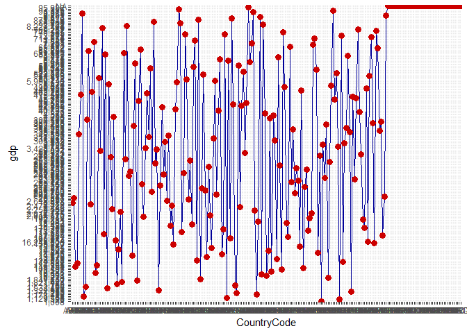

# Case Study 1
Mamadou L Diop  
October 31, 2016  
## INTRODUCTION
## The purpose of this project is an exercise to show how to collect, manipulate, and cleanup datasets. The goal is to prepare tidy data that can be used for later analysis.I will submit a link to a Github repository with my script for performing the analysis, and the codes that describe the variables, the data, and any transformations or work I performed to cleanup the data. You should also include a README.md in the repo with your scripts. This repo explains how all of the scripts work and how they are connected 


## Question 1
## Merge the data based on the country shortcode. How many of the IDs match?

## Loading "downloader" library to allow URL reading for knitr

```r
library(downloader)
```

```
## Warning: package 'downloader' was built under R version 3.3.1
```

## Load package

```r
package <- c("data.table")
sapply(package, require, character.only=TRUE, quietly=TRUE)
```

```
## data.table 
##       TRUE
```

## Download the dataset and creating data frame


```r
GDP_url <- "https://d396qusza40orc.cloudfront.net/getdata%2Fdata%2FGDP.csv"
GDPfile <- file.path(getwd(), "GDP.csv")
download.file(GDP_url, GDPfile)                                   # Downloading GDP data
GDPdata <- data.table(read.csv(GDPfile, skip = 4, nrows = 190))   # Putting GDP data in a dataframe
GDPdata <- GDPdata[X != ""]                         # Removing missing Data
GDPdata <- GDPdata[, list(X, X.1, X.3, X.4)]        
setnames(GDPdata, c("X", "X.1", "X.3", "X.4"), c("CountryCode", "rankingGDP", "Long.Name", "gdp"))  # Renaming data table column name

EduUrl <- "https://d396qusza40orc.cloudfront.net/getdata%2Fdata%2FEDSTATS_Country.csv"
Educfile <- file.path(getwd(), "EDSTATS_Country.csv")
download.file(EduUrl, Educfile)                                      # Downloading Education data
EducData <- data.table(read.csv(Educfile))                           # Putting Education data in a dataframe
data <- merge(GDPdata, EducData, all = TRUE, by = c("CountryCode"))  # Merging GDP and Education datasets
sum(!is.na(unique(data$rankingGDP)))
```

```
## [1] 189
```

## Question 2:
## Sort the data frame in ascending order by GDP (so United States is last). What is the 13th country in the resulting data frame?


```r
data[order(rankingGDP, decreasing = TRUE), list(CountryCode, Long.Name.x, Long.Name.y, rankingGDP, gdp)][13]
```

```
##    CountryCode         Long.Name.x         Long.Name.y rankingGDP   gdp
## 1:         KNA St. Kitts and Nevis St. Kitts and Nevis        178  767
```

## Question 3: 
## What is the average GDP ranking for the "High income: OECD" and "High income: nonOECD" group?


```r
data[, mean(rankingGDP, na.rm = TRUE), by = Income.Group]
```

```
##            Income.Group        V1
## 1: High income: nonOECD  91.91304
## 2:           Low income 133.72973
## 3:  Lower middle income 107.70370
## 4:  Upper middle income  92.13333
## 5:    High income: OECD  32.96667
## 6:                   NA 131.00000
## 7:                            NaN
```

## Question 4:
## Plot the GDP for all of the countries. Use ggplot2 to color your plot by Income Group.

```r
library(ggplot2)
```

```
## Warning: package 'ggplot2' was built under R version 3.3.1
```

```r
# Dark blue lines, red dots
ggplot(data, aes(x=CountryCode, y=gdp)) + 
    geom_line(aes(group=1), colour="#000099") +  # Blue lines
    geom_point(size=3, colour="#CC0000")         # Red dots
```

<!-- -->


## Question 5: 
## Cut the GDP ranking into 5 separate quantile groups. Make a table versus Income.Group. How many countries are Lower middle income but among the 38 nations with highest GDP?


```r
breaks <- quantile(data$rankingGDP, probs = seq(0, 1, 0.2), na.rm = TRUE)
data$quantileGDP <- cut(data$rankingGDP, breaks = breaks)
data[Income.Group == "Lower middle income", .N, by = c("Income.Group", "quantileGDP")]
```

```
##           Income.Group quantileGDP  N
## 1: Lower middle income (38.8,76.6] 13
## 2: Lower middle income   (114,152]  8
## 3: Lower middle income   (152,190] 16
## 4: Lower middle income  (76.6,114] 12
## 5: Lower middle income    (1,38.8]  5
## 6: Lower middle income          NA  2
```

## CONCLUSION
## This project shows that analysing data is the easiest part of a data analyst because the hardest part is cleaning the messy data to prepare it for final analysis.
